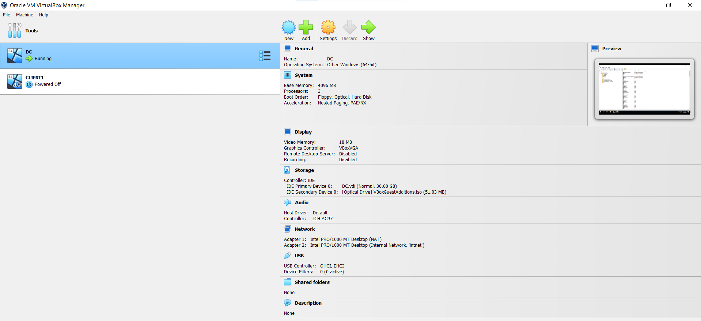
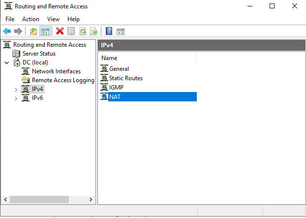

# Home Lab: Active Directory Domain Services

Simulation of a business that uses AD for user and asset management

---

1. Installed VirtualBox to create Client and Domain Controller virtual machines

    - Downloaded Windows Server 2019 ISO as the OS for the Domain Controller that contains an AD server, on the virtual machine
    - Downloaded Windows 10 ISO as the OS for the client that will connect to the domain

2. Created a virtual machine for the domain controller
    - Allocated megabytes for the RAM and hard disk drive, allocated cores for the CPU
    - Installed Active Directory Domain Services
    - Configured 2 network adapters
        - One is dedicated to the internet and is using Network Address Translation. Uses DHCP from host machine's home router
        - The other is dedicated to the internal virtual network that the client VM can connect to. Manually configured the IP address, Subnet mask, DNS server

    
   
    - Configured Routing and Remote Access Server so the client on the private virtual network can access the internet through the domain controller
        - Uses NAT to allow internal clients to connect to the internet using one public IP address

    

    - Configured DHCP and DNS server on the domain controller, so the client virtual machine can automatically obtain an IP address, and connect to the internet
        - Configured DHCP scope, lease duration, default gateway (domain controller’s IP address), DNS server (domain controller’s IP address)
    - Ran a powershell script that will automatically create 200 users in Active Directory

4. Created a second VM for the client and installed Windows 10
    - This VM will connect to the private VirtualBox network
    - The client will be added to the domain and a domain account will be logged into this client VM
    - Joined the domain, mydomain.com. This allows any of the users in the domain to log into this client VM

5. Created shared folders for each group
